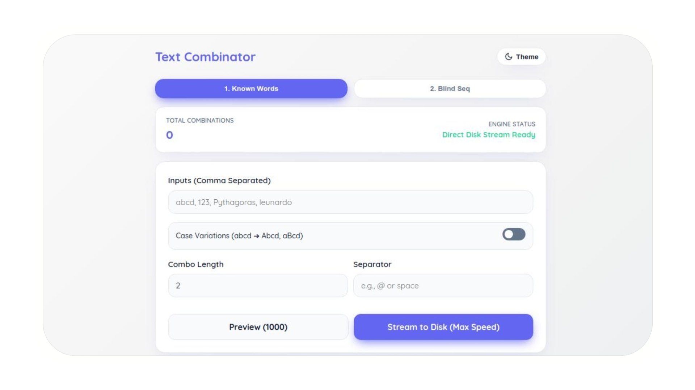

<div align="center">

# Text Combination Generator ✨ 
**RAM-Safe, Direct-to-Disk Permutation & Dictionary Generator**




</div>

---

## ⚠️ CRITICAL DISCLAIMER & TERMS OF USE
> **Read Before Execution:** By downloading, opening, or running this software, you explicitly agree to the following terms.

1. **Authorized Use Only:** This application is developed strictly for educational research, cryptographic testing, and legitimate password recovery. You are explicitly forbidden from using this tool to generate datasets for unauthorized access, malicious brute-forcing, or any illegal activities.
2. **Hardware Responsibility (SSD/HDD):** This tool streams data directly to your local storage bypassing browser memory limits. Generating massive permutations (e.g., sequences yielding billions of results) **will rapidly consume hard drive space and may cause SSD wear**. Always verify the "Total Combinations" estimate before starting a direct-to-disk stream.
3. **Zero Liability:** The creator (MYR) and contributors assume **zero liability** for any hardware damage, data loss, storage exhaustion, or legal repercussions resulting from the use or misuse of this software. You are solely responsible for how you deploy this client-side utility.

---

## ✨ The Problem It Solves
Generating massive custom dictionaries or brute-force wordlists traditionally requires command-line tools or Python scripts. If you try to generate 100 million combinations in a standard web browser, the DOM crashes and the tab runs out of RAM.

**This tool solves that.** It is a beautifully crafted, 100% client-side single-page application (SPA) that uses background Web Workers to crunch the math and the modern `FileSystemWritableFileStream` API to write the data *directly to your SSD*. 

Zero server uploads. Zero RAM crashes. Infinite scaling.

## 🚀 Capabilities & Processing Modes

The engine dynamically calculates permutation mathematics in real-time, letting you know exactly how large your dataset will be before you click start.

| Generation Mode | Logic | Variable Complexity | Memory Profile |
| :--- | :--- | :--- | :--- |
| **Known Words** | Factorial Permutation | Auto Case-Variation (abcd ➔ Abcd) | 🟢 RAM-Safe (Batched) |
| **Blind Sequence** | Exponential Growth | Multi-Charset (a-z, A-Z, 0-9, !@#) | 🟢 RAM-Safe (Batched) |

> *Note: Maximum generation speed is bound only by your CPU's single-thread performance and your hard drive's write speed (NVMe SSDs recommended for sequences over 100 million).*

---

## 🧠 Under the Hood: Direct-to-Disk Streaming

To prevent browser memory allocation failures, the tool completely isolates the UI thread from the generation engine.

```mermaid
graph TD;
    A[User Inputs & Math Estimation] -->|Main Thread| B{Mode Selection}
    B -->|Start: Known Words| C[Web Worker Engine]
    B -->|Start: Blind Sequence| C
    C --> D(Generate Batch: 50,000 strings)
    D --> E{Buffer Full?}
    E -->|No| D
    E -->|Yes| F[PostMessage to Main Thread]
    F --> G[FileSystem Writable Stream]
    G -->|Bypass RAM| H[(Direct to Hard Drive .txt)]
    G --> I[Update UI Progress Bar]
